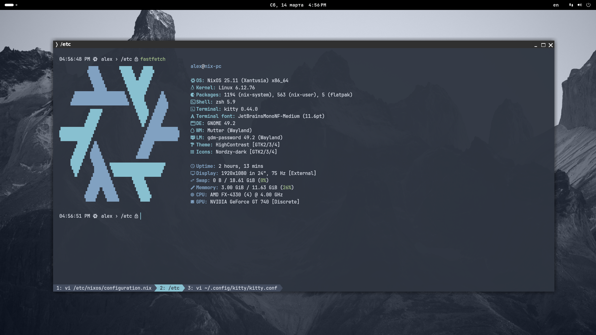
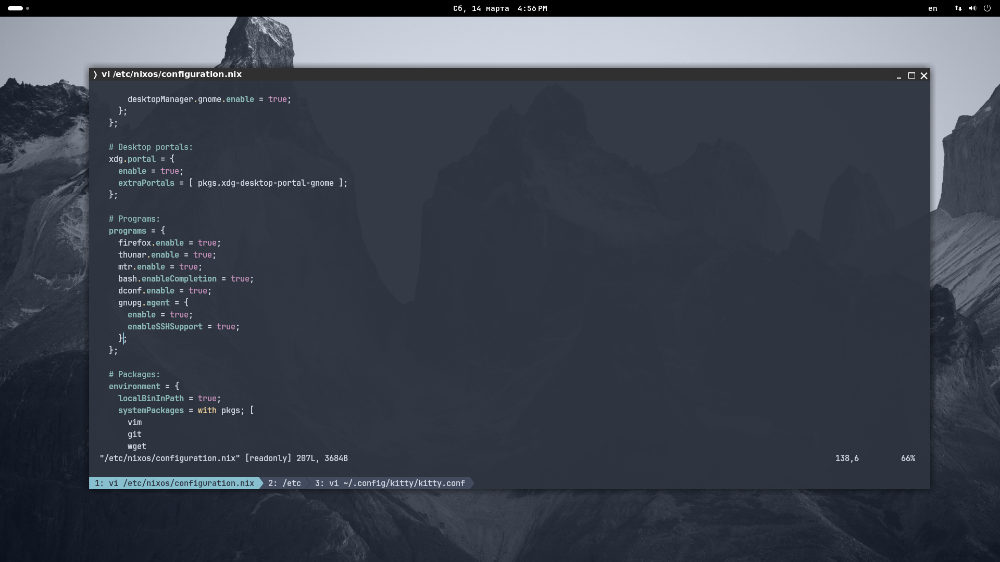

# nixos-configuration


#### ❄️ NixOS Configuration:

> Declarative system configuration for my NixOS machines using reproducible infrastructure.

This repository contains my NixOS system configuration, including system modules, packages, and host-specific settings.
It is designed to be reproducible, modular, and easy to maintain.


#### 🎯 Features:

- Declarative system configuration
- Modular NixOS setup
- Reproducible builds
- Version-controlled infrastructure
- Easy host management
- Simple system rebuild workflow


#### 📁 Configuration file structure:
```plaintext
/etc/nixos/
│
├── users/
│     └── alex/
│          ├── wallpapers/
│          │      ├── mountain_wallpaper_nord.jpg
│          │      └── nixos_wallpaper_main.png
│          ├── bashrc
│          ├── config.jsonc
│          ├── kitty.conf
│          └── starship.toml
│
├── configuration.nix
├── hardware-configuration.nix
└── README.md
```
